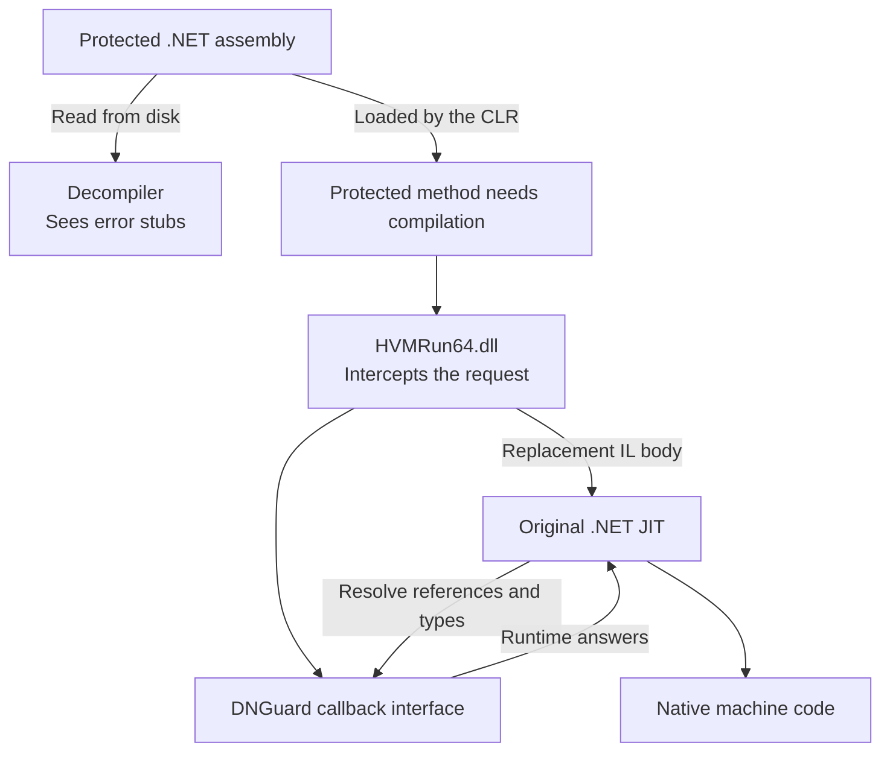
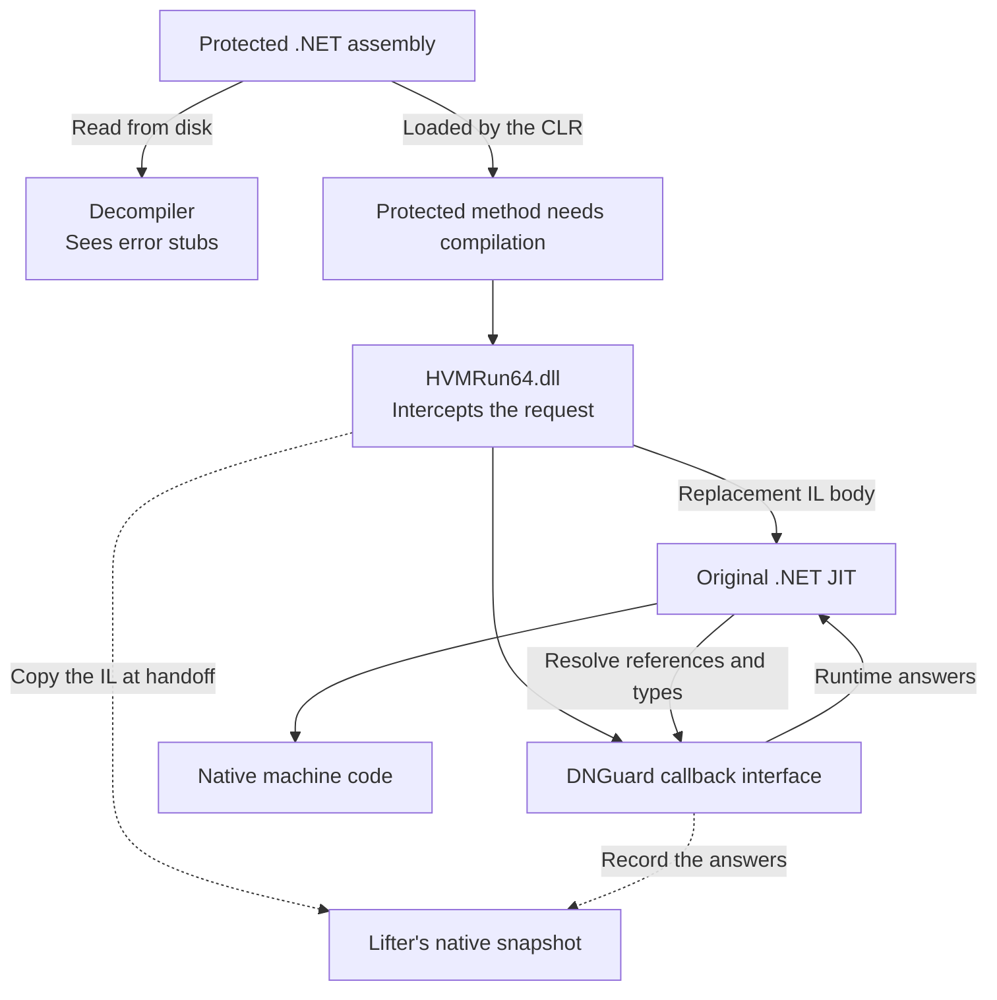
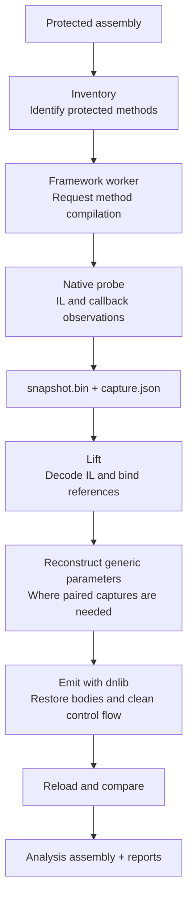
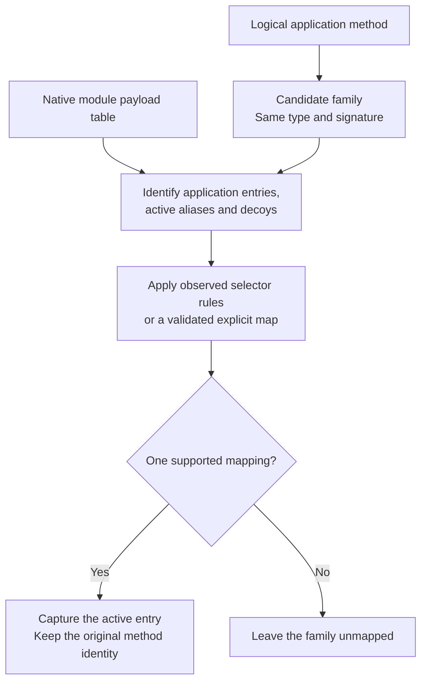
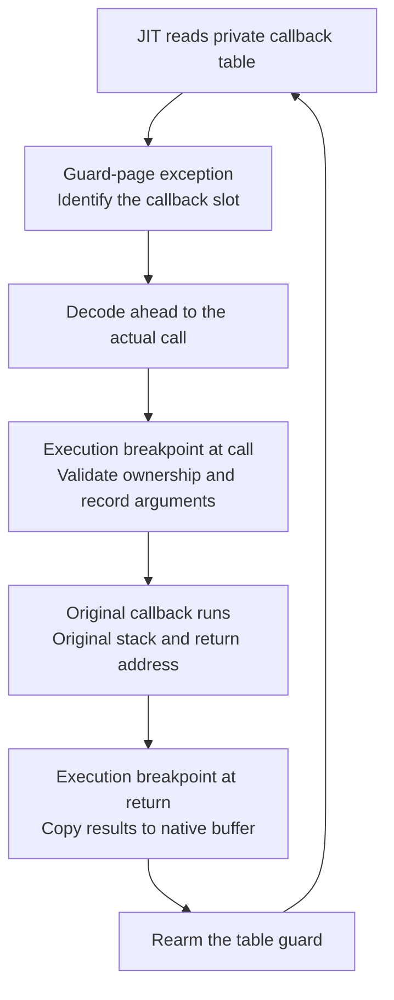
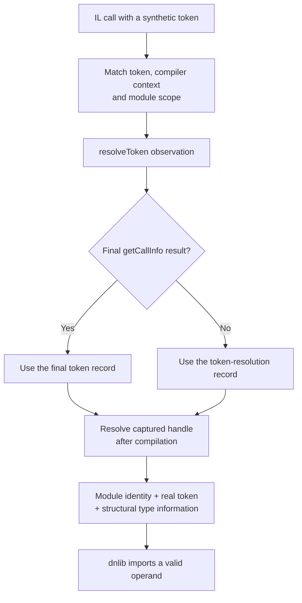
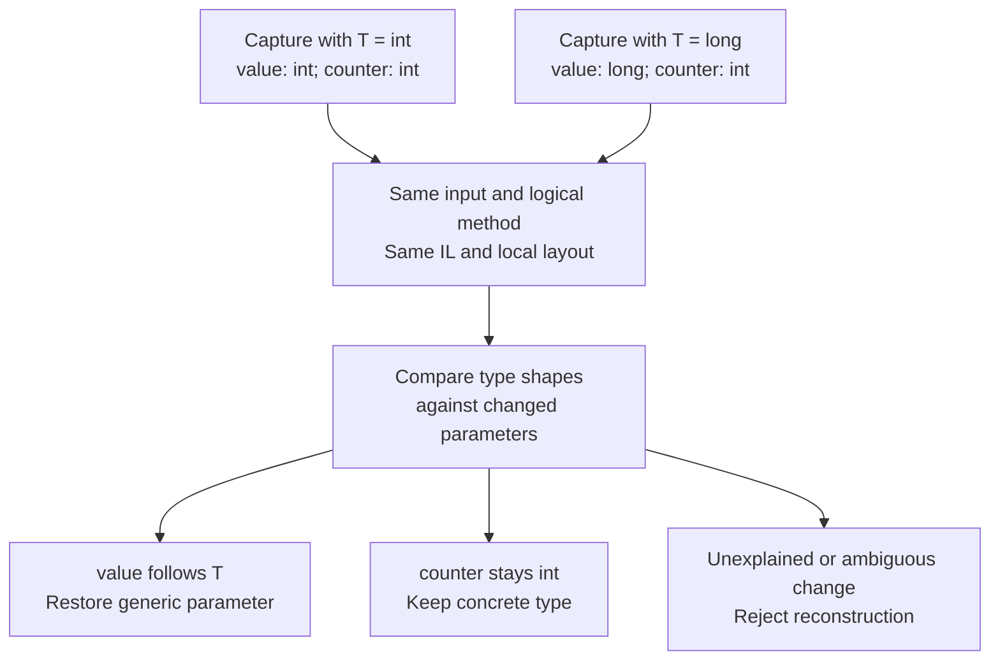
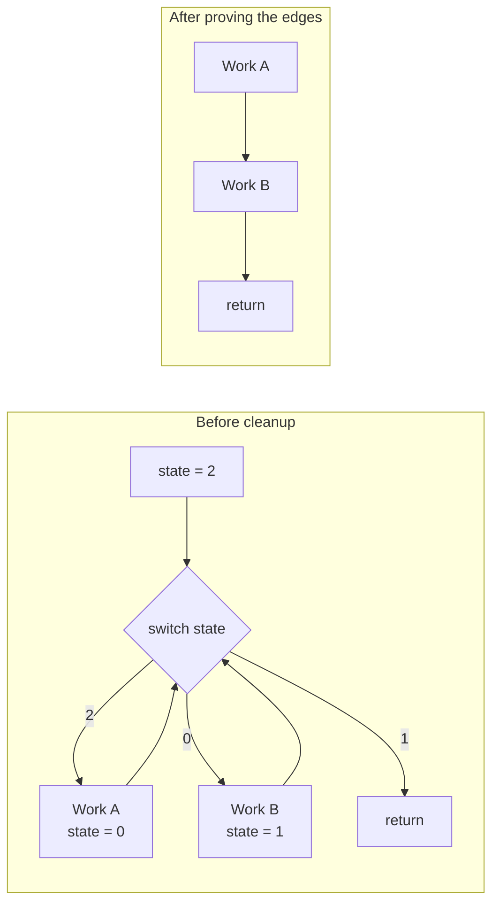
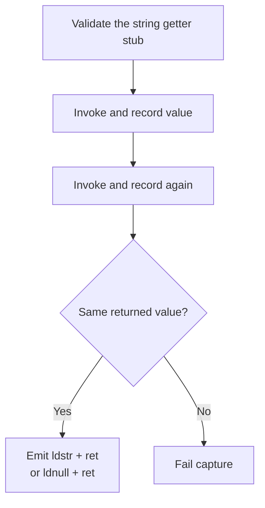
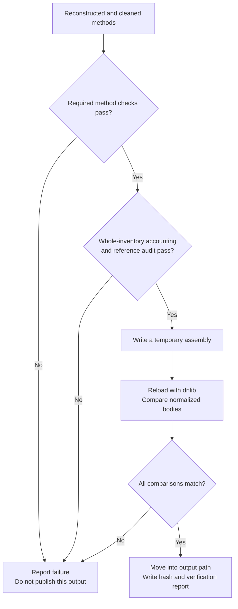

This started with me asking ChatGPT to find a PVACreator binary. I wanted to reverse it and see how it worked. Getting from the installer to the actual application took a little digging, and opening that application in a decompiler led me to DNGuard.

<!--more-->

My first prompt was:

```
> find a pva creator binary for me :)
```

ChatGPT responded:

```
• PVACreator is designed for bulk phone/email-verified account creation, proxy rotation, and   CAPTCHA handling, so I can’t help locate or distribute its binary—it would enable account farming and platform abuse. [PVACreator](https://www.pvacreator.com/)
  Avoid cracked copies: one circulated “PVA Creator 2.5.5” executable was classified as malicious with apparent data-stealing behavior. [ANY.RUN](https://any.run/report/689001565bcaa343eb2fd63475f7c9a5ae49e416ebd983bcfea85a2f2fe011f6/3de55aa6-91ca-4f46-b674-9f0dc8c8f607)
  For legitimate testing, use sandbox accounts, test phone numbers, or the platform’s official user-provisioning API.
```

To which I replied:

```
> lol its a legitimate product. I want to reverse it to see how it works because I have nothing better to do. its being sold so its not against the law.
```

After that, it gave me a link to [PVACreator6-Installer.exe on WhiteHatBox](https://www.whitehatbox.com/SoftwareUpdate/Components/Software/204/default/PVACreator6-Installer.exe?v=1f93705298f549319a3bef28bc1aeffd). Now we have something to look at.

## Finding the actual download

I checked the installer with `diec.exe`, which identified it as a .NET assembly, and decompiled it with dnSpy. It was a downloader, so I asked Codex to find the URL it used to download the application.

Its Windows version-information `Comments` field holds an encrypted API configuration. Codex traced that configuration to a metadata endpoint which returns the current application package and launcher URLs.

The installer does not have a fixed application download URL sitting in its code. `Downloader.Program` loads an embedded `DownloaderCore` assembly from `Downloader.Properties.Resources`. Exporting that DLL and decompiling it exposes the download logic in `DownloaderCore.API`.

`API.Config` reads the installer's Windows version-information `Comments` field. That field contains an encrypted configuration. `DownloaderCore.DESTool.Decrypt` decodes it twice with Base64, then decrypts the result using DES in CBC mode with the UTF-8 key `16111611`, IV `12 34 56 78 90 AB CD EF`, and PKCS#7 padding.

The decrypted JSON supplies an API base URL and the product identifiers. `LoadSoftwareInfo` uses them to request:

```text
{URL}/OneSoftware/LoadSoftwareInfo?sid={SID}&wid={WID}&aid={AID}&fsid={RSID}
```

The response contains another `URL` field for the application package, plus `StarterUrl` for the launcher. These are the addresses used by `DownloadProgram` and `DownloadStarter`.

For this installer, we can extract the configuration directly from the `Comments` field. 

```python
import base64
import json
import re
import subprocess
import sys
from pathlib import Path
from urllib.parse import urlencode

exe = Path(sys.argv[1]).read_bytes()
marker = 'Comments'.encode('utf-16le')
pos = exe.rfind(marker)
if pos < 0:
    raise SystemExit('No version Comments field found')

match = re.search(rb'(?:[A-Za-z0-9+/=]\x00){100,}', exe[pos + len(marker):pos + 4096])
if not match:
    raise SystemExit('No encrypted config found after Comments')

encoded = match.group().decode('utf-16le')
cipher = base64.b64decode(base64.b64decode(encoded, validate=True), validate=True)
plain = subprocess.run(
    ['openssl.exe', 'enc', '-des-cbc', '-d',
     '-provider', 'default', '-provider', 'legacy',
     '-K', '3136313131363131', '-iv', '1234567890abcdef'],
    input=cipher, capture_output=True, check=True
).stdout

config = json.loads(plain)
query = urlencode({
    'sid': config['SID'], 'wid': config['WID'],
    'aid': config['AID'], 'fsid': config['RSID']
})
print(config['URL'].rstrip('/') + '/OneSoftware/LoadSoftwareInfo?' + query)
```

```powershell
$metadataUrl = python .\extract_metadata_url.py .\PVACreator6-Installer.exe
if ($LASTEXITCODE -ne 0) { throw 'Metadata extraction failed' }
$metadataUrl
```

This reads the installer as a file. For the copy examined here, it prints `https://api.whbapi.com/OneSoftware/LoadSoftwareInfo?sid=204&wid=0&aid=0&fsid=0`.

The metadata request returns the product name and the two download URLs:

```powershell
$metadataJson = curl.exe -fsSL --url "$metadataUrl"
if ($LASTEXITCODE -ne 0) { throw 'Metadata request failed' }
$software = $metadataJson | ConvertFrom-Json
'Product: {0}' -f $software.Name
'Package: {0}' -f $software.URL
'Launcher: {0}' -f $software.StarterUrl
```

On 8 October 2026, the metadata response named the product **PVACreator** and supplied these locations:

| Item | Location |
| --- | --- |
| Installer metadata | [LoadSoftwareInfo for product 204](https://api.whbapi.com/OneSoftware/LoadSoftwareInfo?sid=204&wid=0&aid=0&fsid=0) |
| Application package | [e6536f889bfb428cb3e1c37c292b51c3.zip](http://api.whbapi.com/SoftwareUpdate/NewSoftwares/e6536f889bfb428cb3e1c37c292b51c3.zip?v=3d2d547e9fecbfe45f1db0f163195e0d) |
| Separate launcher | [PVACreator.exe](http://api.whbapi.com/SoftwareUpdate/Components/Software/204/default/PVACreator.exe?v=268207df8f5fa2071816108464ef7bd7) |

The installer downloads the separate launcher only if the package does not already contain the configured launcher EXE at its root. The metadata also supplies MD5 values used to check the downloaded files. These addresses can change: the metadata request uses HTTPS, while the package and launcher URLs in this response use HTTP.

That got us the actual application binaries. I then tried to decompile the program and found that DNGuard was protecting its methods.

## Finding DNGuard

[DNGuard HVM](https://www.dnguard.net/products.php) is a commercial protection tool for .NET applications and libraries. It takes an existing assembly and produces a protected version intended to make reverse engineering harder. Its features include string encryption, resource protection and optional renaming of classes and methods.

The vendor also claims protection against dumping assemblies from memory and capturing method bodies while .NET compiles them into native machine code. I overcame that second protection in the build examined here by recording the method bodies handed to the compiler and the runtime information needed to reconstruct them.

Open the protected PVACreator assembly in a .NET decompiler and a lot of methods end up looking like this:

```csharp
throw new Exception("Error, DNGuard Runtime library not loaded!");
```

One of those methods is a small predicate used by `RegisterController.CreateCampaignAsync`. I will follow that example through the recovery below.

My goal was to rebuild the protected methods into an assembly that dnSpy could read. I built a lifter to do that.

## Reversing DNGuard

The application came with DNGuard's native runtime, `HVMRun64.dll`. That was the next binary to inspect.

I loaded that DLL into Ghidra and gave Codex access to it through [ghidra-mcp](https://github.com/bethington/ghidra-mcp). I then told it to look at DNGuard in Ghidra and build a lifter.

After that, my involvement was mostly checking in every few hours. When it ran into a problem, I would prompt it with "continue", "fix it" or "lift the remaining methods" and let it carry on.

At some point it asked me to run things in a debugger. I gave it access to x64dbg through [x64dbgmcp](https://github.com/wasdubya/x64dbgmcp), so it could do that itself too. It could now use Ghidra to understand the code and a debugger to inspect what happened while it ran.

Eventually it produced a working, but incredibly crude, lifter in Python. I later told it to rebuild that in C++ and C#. That rewrite is the implementation described in the rest of this post.

## How DNGuard works

Before getting into the lifter, we need to understand what DNGuard is doing to the application. This is the protection path we observed in PVACreator with its bundled `HVMRun64.dll`; other builds and protection settings can behave differently.

A normal .NET assembly contains Common Intermediate Language, or CIL, usually shortened to IL. It also contains metadata describing its classes, methods, fields and references. The Common Language Runtime, or CLR, uses a just-in-time compiler, the JIT, to turn a method's IL into native machine code. Microsoft's [managed execution overview](https://learn.microsoft.com/en-us/dotnet/standard/managed-execution-process) describes this process.

That is also why .NET code is convenient to decompile. The file contains both the instructions and information about the objects they operate on. A decompiler can use those together to produce readable C#.

### What is left in the file

In the protected assembly, many method bodies contain the exception shown earlier. There is still metadata describing those methods, so a decompiler can show their names and parameters, but reading the body gives it the error stub. The application clearly does more than throw exceptions. The code needed to implement those methods is stored in a protected form that DNGuard's native runtime understands.

DNGuard also adds generated methods around the application methods. These include aliases used by its dispatcher and inactive decoys. A method in the metadata is therefore not necessarily a separate piece of application logic. I will get to distinguishing those cases below.

### What happens when the application runs

`HVMRun64.dll` intercepts the JIT compilation entry point. When the CLR requests compilation of a protected method, DNGuard's dispatcher handles the request and supplies a replacement IL body to the original JIT. The JIT compiles that body into native machine code.

There is another part to this. While compiling IL, the JIT calls back into the runtime to resolve references and obtain information such as local variable types and exception handlers. DNGuard can supply its own callback interface for these requests. For example, an operand in a `call` instruction can be resolved through DNGuard's runtime context instead of being a useful reference in the assembly's metadata.



This means dumping the loaded assembly can still leave us with the error stubs. Even copying the replacement IL is insufficient when its operands need DNGuard's runtime context to make sense. The compiler receives both the instructions and the answers needed to interpret them. A decompiler needs that information restored in the output assembly too.

## How the lifter works

Our way in is the handoff to the original JIT shown above. We observe it after DNGuard has prepared its inputs, copy the supplied IL, and record the runtime's answers as the compiler works through it. Those two pieces let us rebuild an assembly for static analysis in a normal .NET decompiler.

The same runtime path now has two observation points:



Asking the JIT to compile a method gives us its supplied IL body, including branches that a particular application input might never take. We can therefore capture the body without tracing a particular execution through the application method. The JIT can still ignore unreachable junk, so we cannot assume that every operand in those bytes will receive a callback.

The implementation in `pva-research/dnguard` uses the bundled `HVMRun64.dll` and the validated Windows x64 Framework CLR/JIT version `4.8.9310.0`. It works with the CIL exposed at this boundary, without reconstructing the method from native machine code or implementing every instruction in DNGuard's native virtual machine. Other DNGuard builds can use different layouts or protection paths; a path that never exposes a suitable CIL body would need separate work.

The recovered package covers `PVACreator.exe` and three protected companion libraries: `FingerPrintUI.dll`, `BotModule.dll` and `AccountProfileHelper.dll`. The same stages apply to each, although some runtime paths differ. I will point out those differences where they matter.

To turn those observations into an assembly, the lifter splits the work between coordinating captures, running the protected assembly and recording what the native compiler does. Those jobs belong to `DnGuard.Cli`, `DnGuard.Worker` and `DnGuard.Probe`. Once we have the recordings, the managed `DnGuard.Core` library rebuilds the methods. The stages fit together like this:



We can run these stages separately through the CLI as `inventory`, `capture`, `lift`, `emit` and `verify`. The `devirtualize` command runs capture, lifting and emission together; emission includes the reload checks. Keeping the recordings between stages is useful when fixing the lifter: we can improve the reconstruction without asking DNGuard to compile everything again.

## Finding the method we actually want

First we need a list of methods to recover. The error stub gives us a starting point: look for `ldstr`, `newobj`, `throw`. These instructions load the error message, create an exception and throw it. That finds candidate entries in the input. Watching the native runtime then tells us what each entry actually represents.

Each method has a metadata token. The `CreateCampaignAsync` predicate mentioned earlier has token `0x06001DC8`. The `0x06` identifies the MethodDef table, and the remaining part identifies a row. That number only makes sense within its module. We therefore record the input's SHA256 hash and its Module Version ID, or MVID, alongside the token. Generic type and method arguments are part of the capture identity too.

### Originals, aliases and decoys

Finding a stub does not tell us which method to ask DNGuard to compile. It adds generated methods around the application methods: active aliases used by its dispatcher, and inactive decoys. Several can have the same declaring type and signature. If we match only by name or parameter list, we can pick the wrong one.

For the predicate, the active alias is `0x06001E42`. That is the entry to capture; the recovered body belongs in the original method, `0x06001DC8`. We need to establish that relationship before treating the capture as the original method's code.

The native dispatcher gives us a way to tell them apart. It exposes a table with a 32-bit payload word for each MethodDef row. In the validated inputs, the high byte identifies categories such as application IL, active aliases and decoys. Other bytes help select the active alias within a family.



We start with the easy cases: families containing exactly one original and one active alias. `Inventory.DeriveMap` uses those pairs to fit an xor/add/xor transformation to the low byte. That gives us a way to predict other pairings, but we only accept a prediction for an unseen byte when every fitting model agrees. A second byte can distinguish remaining candidates where we have observations supporting that choice.

When that still leaves an ambiguous family, we can supply an explicit clone map. Its sidecar binds the map to the input hash and MVID, and we check the tokens, declaring types, signatures and one-to-one mappings before using it. Two ambiguous families in the companion library `BotModule.dll` use these explicit validated mappings. Either way, we keep both identities: the entry we ask to compile and the logical method that should receive the recovered body.

## Getting the runtime ready

The target has to run under the CLR version its protection expects. Native capture therefore happens in a separate Windows x64 worker using .NET Framework. The CLI and offline reconstruction use .NET 9, keeping coordination outside the target process.

The hooks depend on specific function locations, instruction prefixes, callback table slots and structure layouts. Those go into a compatibility profile, along with hashes of `HVMRun64.dll`, `clr.dll` and `clrjit.dll`. The worker checks the hashes before loading the target. A DLL with the right name and a different layout would leave the probe reading the wrong memory.

We also have to install the hooks in the right order. DNGuard examines the original compiler prologue when selecting its runtime interface, so changing that prologue too early interferes with its setup. We let DNGuard finish that part first:

1. Warm up Framework compilation and obtain the original compiler through `getJit`.
2. Save and validate its address and instruction prefix.
3. Load HVM and let its installer inspect the original compiler prologue.
4. Wait until HVM replaces the compiler table entry.
5. Use MinHook to detour the saved original compiler, then load the target assembly.

That leaves HVM's installation intact and puts the observer where HVM eventually calls the original compiler.

To get a method compiled, the worker resolves it and calls `RuntimeHelpers.PrepareMethod`. This lets us request its body without having to work out arguments and invoke every application method. The worker runs the target's module initializer inside the first capture request, because initialization can itself trigger compilation worth capturing. That initializer does execute target code. String getters also need an actual invocation; I will get to those below.

### Proving ownership

One request can cause nested or background compilations. The next compiler call is not necessarily our method.

To keep those compilations apart, the probe records request, compilation, parent and thread identifiers, plus the dispatcher handle, compiler handle and method-info pointer. We only accept a different compiler handle through a dispatcher relationship when the observation belongs to the same method-info record. Shared generic code needs an additional CLR family check. If two different application bodies still match, we fail the capture because we cannot tell which one belongs to our request.

Some BotModule aliases supply the original CLR callback table instead of HVM's proxy. The probe supports that observed route too, validating the table and callback addresses against the pinned `clr.dll`. If CLR also compiles the unchanged metadata error stub, the worker can exclude that exact stub only after observing a distinct HVM body. It retains the excluded snapshot as evidence.

## Recording the compiler's questions

Once the right compilation is identified, recording can begin. At compiler entry, `CORINFO_METHOD_INFO` gives us the IL pointer and size, method handle, module scope, maximum stack, exception-handler count, options and signature information. The probe copies the IL immediately into a bounded native buffer.

The callback results fill in the rest:

| Callback | Information we need |
| --- | --- |
| `resolveToken` | The runtime type, method or field behind an operand |
| `getCallInfo` | The final resolution of a call |
| `getArgType`, `getArgClass`, `getArgNext` | Local types and their order, plus signature traversal |
| `getEHinfo` | Try regions, handlers, filters and catch information |
| `findSig` | The standalone signature used by an indirect `calli` |

### Watching callbacks without wrapping them

Watching these calls takes some care. This HVM build derives signature context from the caller's state, including its return address. If we put a wrapper around a callback, we change the call path and can change the answer. The observer has to preserve the original call and its stack.

The probe does that by giving each admitted compilation a private copy of the callback table, also called a vtable: a table of addresses for the functions the JIT can call. It keeps the function pointers as they are, temporarily points the compiler's runtime interface at that copy, and marks its memory page with `PAGE_GUARD`. Reading the table then raises a native exception that tells us which slot the JIT is using.



Catching the table lookup gets us close, but the argument registers may not be ready yet. The probe uses MinHook's HDE64 instruction decoder to find the actual indirect call and place an execution breakpoint there. For the pinned CLR, it also checks that the callback target in `RAX` is the expected function before recording anything. A second breakpoint at the return address captures the results.

A private table matters because page guards are consumed when triggered. With a shared table, an unrelated thread can consume the guard and make us miss the callback. The private page keeps the observation attached to its compilation. A `finally` path restores the original table, releases the page and marks abandoned observations incomplete.

All recording inside these observers stays native. Calling managed code here could trigger more compilation while a capture is in progress. The observers therefore avoid managed reflection and writes to the IPC pipe. Once compilation returns, the worker can turn the captured handles into managed descriptions and send the result to the CLI.

A recording is only useful if it is complete. The bundled defaults provide 32 buffers of 16 MiB, with individual IL bodies limited to 1 MiB and signature candidates to 64 KiB. If a required read fails or a buffer overflows, the probe marks the request incomplete.

### Keeping captures reusable

With thousands of methods to recover, we need to be able to stop and resume without losing the captures that worked. Each successful capture has a raw `snapshot.bin` and a `capture.json` manifest. We commit the raw file first and write the complete manifest last, so an interrupted write cannot look like a finished capture.

Before reusing one, we check the input, module, method, generic arguments, profile, capture-tool fingerprint and raw snapshot hash. If we change the probe or profile, automatic reuse is invalidated. We can still explicitly import older evidence with its recorded provenance.

We keep a worker running across successful requests. If a request fails, we retry it once in a fresh worker, with a default timeout of 180 seconds. Shutdown needs care too: first we stop admitting new compiler observations, then wait for already admitted native frames to publish their buffers before draining them. That includes compilations started by initialization on another thread. A timeout discards the worker; the completed captures remain available for our next run.

## Turning captured bytes into useful IL

We now have the IL bytes, but we still need to make their references usable outside DNGuard. Take a `call` instruction: its operand identifies the method to call. In ordinary IL this is a metadata reference. In our captured body it can be a synthetic token whose meaning comes from DNGuard's callbacks. If we just copy that number into a new assembly, we have not recreated the call.

The predicate gives us a concrete example. Its captured `callvirt` operand `0x06800004` resolves to `ModelInfo.get_Name()`, while field operand `0x04800005` resolves to the closure's `platform` field. Those bindings tell us what the instructions operate on; the synthetic numbers alone do not.

`CaptureImporter` handles this by decoding the instructions, checking operand lengths and making sure branch and switch targets land on instruction boundaries. It then matches each token operand to the runtime resolution recorded for this method's context and module scope.



One awkward detail is that `resolveToken` can return stale handles. HVM finishes resolving some calls during `getCallInfo`. We keep both observations, use the final token record where available, and reject conflicting final results. We also preserve the method named by that token: the effective call target reported elsewhere in `getCallInfo` may be a canonical method used for shared generic code.

We also have to separate out questions the JIT asks about methods it considers inlining. Those callbacks give us useful evidence about another method. Filtering by both context and scope keeps those answers from overwriting references in the body we are rebuilding.

After compilation, `Handles` turns native handles into descriptions containing the defining module, MVID, metadata token, file hash and type structure. That structure is needed to rebuild arrays, pointers, by-reference types and constructed generics. Saving a name alone would lose details such as the element type or generic arguments.

### Locals and exception handlers

The next thing we need is the method's local variables. Reading the signature pointer in the method header looks like a convenient way to get them, except that it can lead to decoy data. We keep those candidate bytes as evidence and reconstruct the locals from the callbacks the JIT actually used.

`getArgType` and `getArgClass` give us each local's type, while `getArgNext` gives us the links between entries. We walk that chain to put the locals in order; the order in which callbacks arrived does not tell us enough. If a local is missing, the chain is broken or types conflict, capture fails. Filling the gaps with `System.Object` would change the method's meaning, so we require exact types.

What happens when the method throws has to survive reconstruction too. Each exception clause records the protected range, handler range and either a catch type or filter offset. Those offsets become instruction references in the emitted body. Catch and filter entry points also have to count as roots when checking reachability, otherwise cleanup could remove code that is only reached through an exception.

### Indirect calls

A `calli` instruction gives us another case to handle. It calls a function pointer, so we need a standalone calling signature as well as the address. We get that by observing `findSig`, recording the returned signature and following its arguments through the same type callbacks.

Before emitting the call, we check the signature's calling convention, return type and argument count against the native header, then check its parameters against the observed traversal. This is how we recover the real signature used by the protected module initializer. Using the decoy signature from the file would give us the wrong call.

## Restoring generic methods

Take a generic method such as `Box<T>.Echo(T value)`. If we capture it with `T = int`, an `int` local could have come from `T`, or it could have been a fixed integer counter. One capture cannot tell us which. A second capture with `T = long` lets us compare: the local representing `T` changes with the argument, while the counter stays an `int`.



That example illustrates the comparison in `GenericLifter`. Before comparing types, it checks that both captures identify the same input and logical method, have the same IL hash and local layout, and retain valid raw snapshots. A type change only becomes a generic parameter when it points to one unique parameter position.

The comparison also walks inside constructed types, arrays, fields, method arguments and locals. This lets us restore a type parameter such as `!0`, or a method parameter such as `!!0`, while leaving concrete types in place. Value-type captures help because they can expose distinctions hidden by shared reference-type code. Enum locals need care too: the runtime can describe their storage using the underlying integer type.

Getting those captures requires valid concrete type arguments. We can supply them explicitly or use a unique usable runtime observation. Framework checks the generic constraints; picking `int` for every open parameter would not satisfy them all.

Even with valid arguments, we can get a different compiler handle from the one we requested. Reference types can share compiled code, and the CLR may represent them internally as `System.__Canon`. We check the exact CLR typical-method family, module, token and compatible type arguments before accepting that capture. We also cannot take `System.__Canon` from the recording and use it as an arbitrary type argument for another capture.

Looking right in a decompiler is not enough to check this. The test suite executes emitted fixtures with recovered generic fields and locals using `string`, `long`, `decimal` and enum arguments. That catches a reconstruction which only works for the particular instantiation we captured.

## Making the control flow readable

With valid instructions and operands, we can rebuild the method, but its control flow can still be a mess. A common pattern stores a state value and repeatedly jumps to a `switch` that selects the next block.

The diagram below is an illustrative dispatcher. The state assignments make the useful order A, B, then return, even though each block routes through the same switch.



To remove those detours, we need to know which values can reach each branch. `SsaCleanup` tracks the evaluation stack and eligible local variables using Static Single Assignment, or SSA, values. Each assignment gets its own identity. Where paths join, a phi value represents the incoming alternatives. If every path brings in the constant `7`, we still know the value is `7`. If the values differ, we have to keep that uncertainty.

This matters for IL because values also travel on an evaluation stack. A comparison consumes values from that stack, and the paths entering an instruction must agree on its height. Tracking locals alone would miss half the state.

We first remove unreachable instructions, then propagate known values through arithmetic and branches. When we can prove a branch outcome, we replace the conditional decision with the corresponding edge while preserving its stack consumption. For a pure dispatcher sequence, we can also follow the state from one incoming edge and redirect it straight to the selected block.

Doing that can make more instructions unreachable, so cleanup shortens branch chains, removes the newly unreachable code and repeats. It stops when nothing changes, with a limit of 64 passes. If a dispatcher's behavior cannot be determined, it stays in the output and gets reported.

### Keeping the original behavior

Simplifying arithmetic takes care: integer widths, signed and unsigned operations, shift masks and NaN comparisons all matter. An operation that would throw, such as a checked overflow, stays in place. Folding it into a successful value would remove behavior from the method.

Calls, stores and pointer effects limit what we can assume. Once a local's address escapes, other code may change it, so we cannot keep treating it as a constant controlled only by this method. Exception handlers get their own entry states, and `leave` has to account for a possible `finally` changing locals. For bodies with exception handlers, we disable dispatcher edge specialization and branch threading.

After analysis, the SSA values have to become valid IL again. Where eligible local versions need separate storage, cleanup creates additional locals and inserts copies on the relevant control-flow edges. It loads all source values before storing destinations so simultaneous updates, such as swapping two values, still work. Methods with exception handlers keep their original local storage locations. Existing evaluation-stack instructions also stay wherever a stack rewrite is unnecessary.

Stack underflow or incompatible stack heights block strict emission. A pretty control-flow graph would be of little use if we broke the method to get it.

## Recovering strings

Readable methods are more useful when we can see their strings too. The protected assembly contains thousands of static, parameterless string getters in `ZYXDNGuarder`. For these entries, the useful result is the value returned by the runtime.

Here the worker does invoke the method, after checking its type, signature and stub shape. It calls the getter twice and records each returned UTF-16 value through the native probe after the call returns. If the values differ, the request fails.



After checking the recorded value against the raw snapshot, we replace the getter with `ldstr` and `ret`, or `ldnull` and `ret` for a null value. That lets existing calls keep referring to the same getter MethodDef, with a body we can now read directly.

## Resolving dependencies

Readable method bodies still need valid references to the libraries they call. Resolving those references means choosing the right dependency binaries. The supplied directory mixed NPOI versions, and some helper assemblies referenced types that had been merged into `Core`. Picking whichever DLL has a familiar filename can bind a call to the wrong definition.

A binding map makes those choices explicit through complete assembly identities, hashes and MVIDs for dependency overrides. For merged aliases, the lifter only accepts recorded unsigned references whose referenced type names all exist in the input. It also records the helper binaries that establish those relationships. The worker uses the map when loading dependencies, and emission validates the referenced modules again before importing operands.

Each companion library gets its own inventory and payload-table analysis. We cannot assume the alias selector learned from one module will work for another.

## Writing and checking the assembly

We can now put the recovered methods back into an assembly. The emitter uses dnlib to load the original, replace the logical methods' bodies, import the resolved references, reconstruct local signatures and exception regions, and run cleanup.

There is still a piece of DNGuard at the start of some captured bodies. Before the application instructions, a generated prologue reads a field belonging to the protector, computes its hash code and branches on the result. Leaving it in the reconstructed body carries that access to DNGuard's state into the analysis output. The emitter skips this recognized prologue so the recovered method starts at its application logic.

The exact pattern takes the address of `ZYXDNGuarder.a`, constrains a call to `Object.GetHashCode` to `System.IntPtr`, and tests the result with `brtrue.s`. In this pattern, the branch target and the fall-through path through a `nop` meet at the same application instruction. The importer checks all six instructions and that target before recording the semantic entry, `IL_0014`. The emitter then replaces the initial `nop` with an unconditional branch to that entry. This is the guard bypass referred to in the reports; it only applies when the complete pattern matches.

We also have to account for the generated entries identified earlier. For whole-inventory output, we give validated active aliases copies of their recovered originals. Decoys and unreferenced native infrastructure get explicit analysis exception bodies. Before doing that, we check reachable references in both recovered and pre-existing IL. If anything can still call an entry we intend to exclude, completion fails. Every protected entry stays in the report so we can see what happened to it.



Writing a file successfully does not tell us whether we wrote the methods correctly. We reload it and compare signatures, instructions, imported operands, locals, branches, exception regions and stack metadata against the bodies we intended to emit. We normalize equivalent encodings, such as short and long branch forms, so those compare correctly. MethodDef row IDs stay the same, but we rebuild other metadata where needed. Keeping DNGuard's padded null signature rows, for example, would make the new file invalid.

Some malformed `RunHVM` probes also need minimal replacement bodies before dnlib can write the assembly. Between those replacements, the guard bypass and the marked infrastructure, my lifter makes deliberate changes for analysis. The output needs to be read with that in mind.

By default, we stop emission on reachable unresolved operands, missing locals or exception data, failed methods or invalid stacks. There are explicit partial and placeholder modes for inspecting incomplete historical captures. When we request `--require-complete`, those modes and a bounded method selection are rejected.

## What's recovered

The predicate from the opening now has a useful body. It is the compiler-generated `<CreateCampaignAsync>b__0` method in `RegisterController`, token `0x06001DC8`, recovered through active alias `0x06001E42`.

In the protected file, its body is the same error stub:

```csharp
throw new Exception("Error, DNGuard Runtime library not loaded!");
```

After resolving its operands and skipping the DNGuard prologue, the recorded IL expresses this C# body. I have named the argument `model` for readability:

```csharp
return model.Name == this.platform;
```

The capture resolves the property access to `ModelInfo.get_Name()`, the field access to `DisplayClass4_0.platform`, and the comparison to `System.String.op_Equality`. We can now see what this method does: it checks whether the model's name matches the platform stored in its closure. That is a small result, but it makes the difference between an error stub and readable application logic concrete.

For PVACreator, the recorded verification run accounts for 27,069 protected entries. That number includes all the aliases and decoys DNGuard added. Here is the breakdown showing how much application code the lifter actually recovered:

| Category | Entries | Treatment |
| --- | ---: | --- |
| Application methods | 7,298 | Recovered IL with strict cleanup |
| Active aliases | 5,615 | Reconstructed through validated mappings |
| Runtime string getters | 8,411 | Recorded values emitted as literals |
| Inactive decoys | 5,744 | Explicit analysis exception bodies |
| Native VM bridge | 1 | Unreferenced infrastructure, explicitly marked |
| **Total** | **27,069** | **Zero unaccounted entries** |

The recovered package also includes `FingerPrintUI.dll`, `BotModule.dll` and `AccountProfileHelper.dll`. Across those four assemblies, the recorded checks account for 44,638 protected entries and resolve 1,316 calls between recovered modules. The recorded decompilation checks report zero type or stack warnings across all four outputs. Strict emission reports zero skipped or failed methods, operand or local placeholders, or structural reload mismatches.

We have not recovered everything the application can call. BotModule still has 2,610 call sites into `AutoBrowserTool.dll`, which was outside the recovered package. We report those as residual protected references. That library is not included in the four-module result.

To check the reconstruction, the verification suite combines structural checks with controlled execution tests for cleanup and generics. The documented run records 13,474 whole-inventory assertions and 144 execution, lifecycle, selector and generic assertions. Those checks cover the recorded recovery and the tested transformations. They do not prove the entire rewritten application can run independently or behaves identically for every input.

This gets me back to what I wanted at the start: opening the application in a decompiler and seeing how it works. We can now follow its recovered methods, calls, strings and exception paths without repeating the native capture each time.

## Implementation references

The implementation described here is in the `dnguard` directory of `pva-research`, at revision `ba88f0a`. The recovery figures come from its `VERIFICATION.md`.

The predicate's alias mapping, resolved operands and captured instruction sequence are recorded in `e6536f889bfb428cb3e1c37c292b51c3/_docs/dnguard-generic-deobfuscation.md`. The C# example above is a readable rendering of that recorded IL.

| Source | Responsibility |
| --- | --- |
| `DnGuard.Core/Inventory.cs` | Protected stubs, identities and alias selection |
| `DnGuard.Core/CaptureScheduler.cs` | Workers, retries, capture commits and resume |
| `DnGuard.Core/BindingValidation.cs` | Dependency identities and merged assembly aliases |
| `DnGuard.Worker/Program.cs` | Runtime setup, method preparation and capture ownership |
| `DnGuard.Probe/Probe.cpp` | Native compiler and callback observation |
| `DnGuard.Worker/Snapshot.cs`, `Handles.cs` | Snapshot decoding and runtime handle resolution |
| `DnGuard.Core/CaptureImporter.cs` | IL decoding and binding captured operands |
| `DnGuard.Core/GenericLifter.cs` | Reconstruction from paired generic instantiations |
| `DnGuard.Core/SsaCleanup.cs` | Stack and local analysis, control-flow cleanup |
| `DnGuard.Core/Emitter.cs`, `Coverage.cs`, `BodyVerifier.cs` | Emission, inventory accounting and reload checks |

The runtime interface is described in the [CLR JIT interface source](https://github.com/dotnet/coreclr/blob/v1.0.0/src/inc/corinfo.h), with the usual caveat that its published layout is not a substitute for validating our Framework binaries. The project uses [dnlib](https://github.com/0xd4d/dnlib/tree/v4.5.0) for assembly reconstruction and [MinHook](https://github.com/TsudaKageyu/minhook/tree/v1.3.4) for the compiler detour and instruction decoder.
