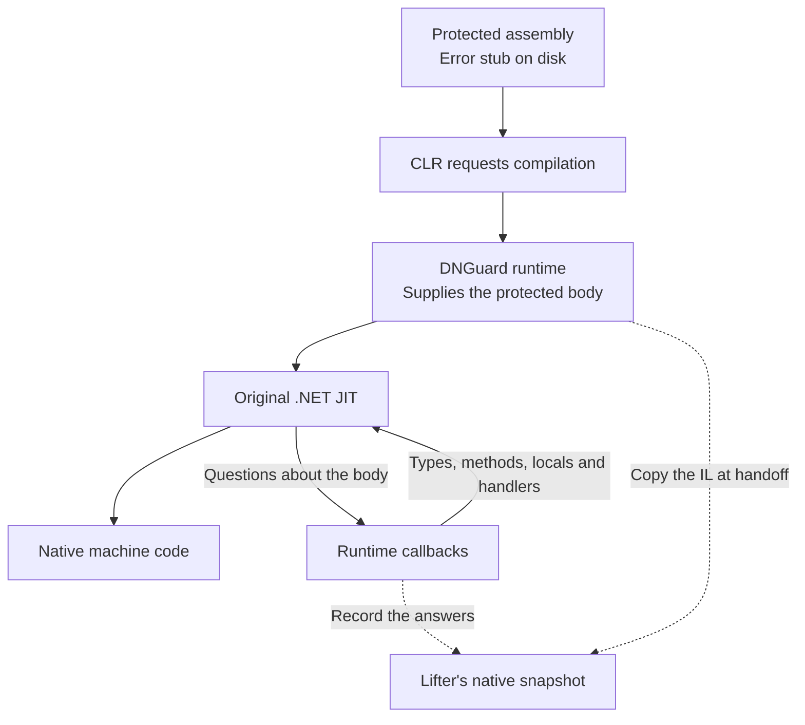
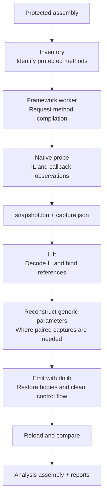
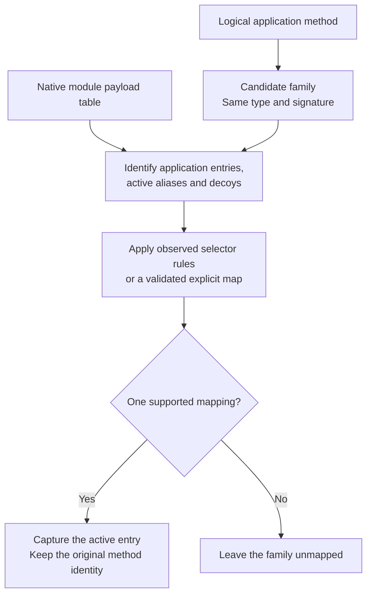
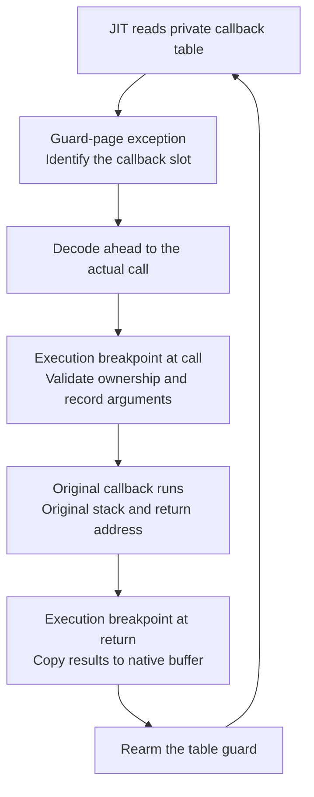
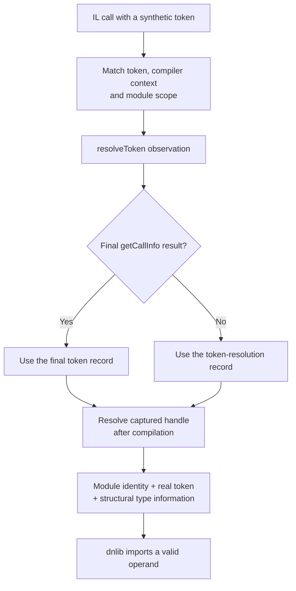
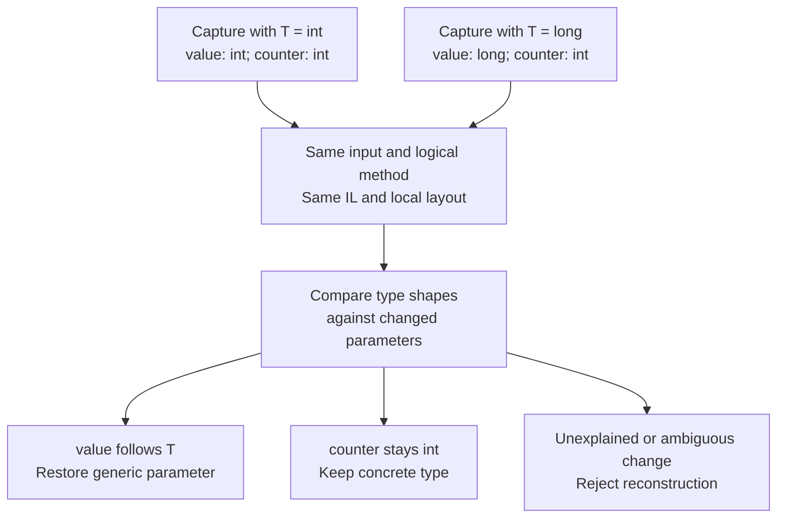
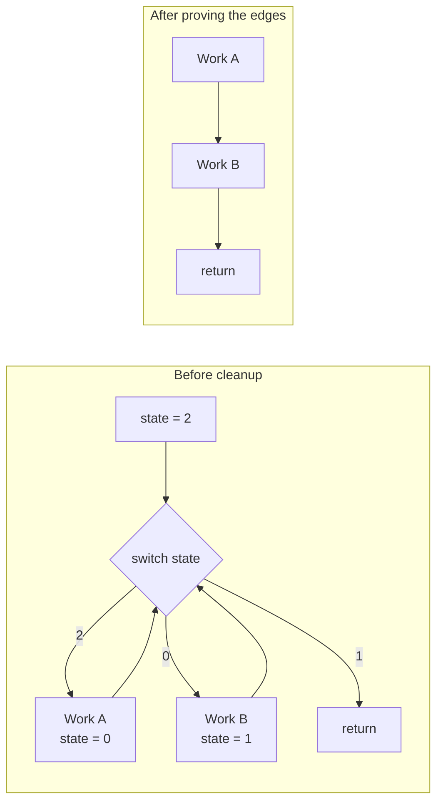
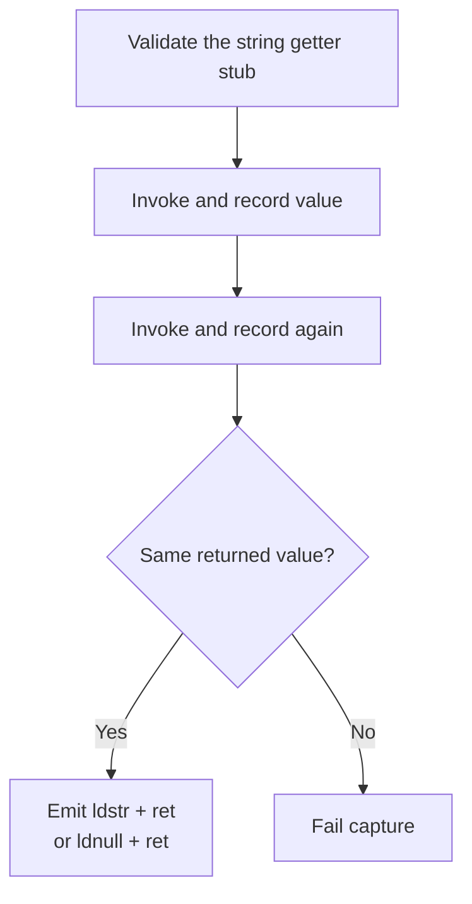
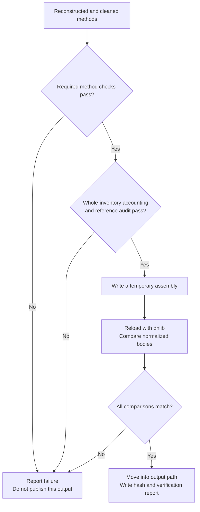

Open the protected PVACreator assembly in a .NET decompiler and a lot of methods end up looking like this:

```csharp
throw new Exception("Error, DNGuard Runtime library not loaded!");
```

The application clearly does more than throw exceptions. DNGuard's native runtime supplies the real method bodies when the .NET runtime needs to compile them. That gives us a useful place to look: the point where DNGuard hands a method to the JIT compiler.

Our lifter records that handoff, follows the compiler's requests for types and methods, and rebuilds an assembly that a normal .NET decompiler can read. In this post I will explain how that works, including the parts that make a simple IL dump insufficient.

<!--more-->

This covers the implementation in `pva-research/dnguard`, using the bundled `HVMRun64.dll` and the validated Windows x64 Framework CLR/JIT version `4.8.9310.0`. The output is an assembly for static analysis. Other DNGuard builds can use different layouts or protection paths, so the runtime version matters throughout this process.

## Where the code becomes visible

A normal .NET assembly contains Common Intermediate Language, or CIL, usually shortened to IL. It also contains metadata describing its classes, methods, fields and references. The Common Language Runtime, or CLR, uses a just-in-time compiler to turn a method's IL into native machine code. Microsoft's [managed execution overview](https://learn.microsoft.com/en-us/dotnet/standard/managed-execution-process) describes this process.

In this protected assembly, the method body stored in the file can be the error stub shown above. DNGuard intercepts compilation and presents a different body to the original JIT. The JIT then asks the runtime questions about that body: which method does this call reference, what type is this local variable, and where are the exception handlers?



The lifter uses the CIL exposed at this boundary. It does not need to reconstruct that method from the machine code produced afterwards. It also does not implement every instruction in DNGuard's native virtual machine. A protection path that never exposes a suitable CIL body would need separate work.

This is dynamic capture, but it is not a trace of one execution through the application method. Asking the JIT to compile a method gives us its supplied IL body, including branches that a particular application input might never take. The JIT can still ignore unreachable junk, so we cannot assume that every operand in those bytes will receive a callback.

## The pipeline

The implementation has three main parts. `DnGuard.Cli` coordinates the work, `DnGuard.Worker` loads the target under .NET Framework, and `DnGuard.Probe` records native compiler activity. The managed `DnGuard.Core` library turns those records into an output assembly.



The CLI exposes these stages as `inventory`, `capture`, `lift`, `emit` and `verify`. `devirtualize` runs capture, lifting and emission together; emission includes the reload checks. Keeping the evidence between stages means we can improve the managed reconstruction without repeating every native capture.

## Finding the method we actually want

First we enumerate methods with the three-instruction stub shape: `ldstr`, `newobj`, `throw`. These instructions load the error message, create an exception and throw it. This is a recognizer for the supplied input; the later native evidence determines what each protected entry represents.

Each method has a metadata token, such as `0x06001E3E`. The `0x06` identifies the MethodDef table, and the remaining part identifies a row. That number only makes sense within its module. We therefore record the input's SHA256 hash and its Module Version ID, or MVID, alongside the token. Generic type and method arguments are part of the capture identity too.

### Originals, aliases and decoys

DNGuard adds generated methods around the application methods. Some are active aliases used by its dispatcher, and others are inactive decoys. Several can have the same declaring type and signature. Matching a method by its name or parameter list is therefore insufficient.

The native dispatcher exposes a table with a 32-bit payload word for each MethodDef row. For these validated inputs, the high byte identifies categories such as application IL, active aliases and decoys. Other bytes help select the active alias within a family.



`Inventory.DeriveMap` starts with families containing exactly one original and one active alias. Those pairs provide observations for the selector. The implementation fits an xor/add/xor transformation to the low byte. For a previously unseen byte, it predicts a result only when every fitting model agrees. A second byte can disambiguate remaining candidates where there is observed evidence for it.

An explicit clone map is also supported. Its sidecar binds the map to the input hash and MVID, and validation checks tokens, declaring types, signatures and one-to-one mappings. The two ambiguous BotModule families use explicit validated mappings. The lifter keeps both identities: the entry prepared for capture and the logical method that receives the recovered body.

## Getting the runtime ready

Native capture runs in a separate Windows x64 worker using .NET Framework. The CLI and offline reconstruction use .NET 9. This lets the target run under the CLR version its protection expects while keeping orchestration outside that process.

Before loading the target, the worker checks the hashes of `HVMRun64.dll`, `clr.dll` and `clrjit.dll` against the compatibility profile. The profile also records function locations, expected instruction prefixes, callback table slots and structure layouts. A matching filename is not enough.

Hook installation has an order to it:

1. Warm up Framework compilation and obtain the original compiler through `getJit`.
2. Save and validate its address and instruction prefix.
3. Load HVM and let its installer inspect the original compiler prologue.
4. Wait until HVM replaces the compiler table entry.
5. Use MinHook to detour the saved original compiler, then load the target assembly.

Installing our detour too early changes the prologue HVM examines when selecting its runtime interface. Waiting for HVM first leaves its installation intact and puts our observer where HVM eventually calls the original compiler.

For a capture request, the worker resolves the chosen method and calls `RuntimeHelpers.PrepareMethod`. The target's module initializer runs inside the first capture request because initialization can itself trigger the compilation we want to observe. For normal method captures we prepare the method; the worker does not invoke every application method with invented arguments. Module initialization does execute target code. String getters have their own invocation path, described below.

### Proving ownership

One request can cause nested or background compilations. The next compiler call is not necessarily our method.

The probe records request, compilation, parent and thread identifiers, plus the dispatcher handle, compiler handle and method-info pointer. A different compiler handle is accepted through a dispatcher relationship only when the observation belongs to the same method-info record. Generic shared code has an additional CLR family check. If two different application bodies still match the request, capture fails as ambiguous.

Some BotModule aliases supply the original CLR callback table instead of HVM's proxy. The probe supports that observed route too, validating the table and callback addresses against the pinned `clr.dll`. If CLR also compiles the unchanged metadata error stub, the worker can exclude that exact stub only after observing a distinct HVM body. It retains the excluded snapshot as evidence.

## Recording the compiler's questions

At compiler entry, `CORINFO_METHOD_INFO` gives us the IL pointer and size, method handle, module scope, maximum stack, exception-handler count, options and signature information. The probe copies the IL immediately into a bounded native buffer.

The callback results fill in the rest:

| Callback | Information we need |
| --- | --- |
| `resolveToken` | The runtime type, method or field behind an operand |
| `getCallInfo` | The final resolution of a call |
| `getArgType`, `getArgClass`, `getArgNext` | Local types and their order, plus signature traversal |
| `getEHinfo` | Try regions, handlers, filters and catch information |
| `findSig` | The standalone signature used by an indirect `calli` |

### Watching callbacks without wrapping them

This HVM build derives signature context from the caller's state, including its return address. Replacing a callback with a wrapper changes the call path and can change the answer. We need to observe the original call with its original stack.

Each admitted compilation gets a private copy of the callback table, also called a vtable: a table of addresses for the functions the JIT can call. The function pointers in that copy are unchanged. The probe temporarily points the compiler's runtime interface at this private table and marks its memory page with `PAGE_GUARD`. Reading the table then raises a native exception that tells us which slot the JIT is using.



The table lookup can happen before argument registers are ready. MinHook's HDE64 instruction decoder finds the actual indirect call, and the probe places an execution breakpoint there. For the pinned CLR, it also checks that the callback target in `RAX` is the expected function before recording anything. A second stop at the return address captures the results.

A private table matters because page guards are consumed when triggered. With a shared table, an unrelated thread can consume the guard and make us miss the callback. The private page keeps the observation attached to its compilation. A `finally` path restores the original table, releases the page and marks abandoned observations incomplete.

All recording inside these observers stays native. They do not invoke managed reflection or write to the IPC pipe. Managed work could trigger more compilation at exactly the point we are trying to observe. Once compilation returns, the worker can safely turn captured handles into managed descriptions and send the result to the CLI.

The buffers have explicit limits. With the bundled defaults, there are 32 buffers of 16 MiB; individual IL bodies are limited to 1 MiB and signature candidates to 64 KiB. A failed required read or overflow makes the request incomplete.

## Turning captured bytes into useful IL

An instruction such as `call` contains an operand identifying its target. In ordinary IL this is a metadata reference. In the captured body, DNGuard can use a synthetic token whose meaning comes from its callbacks. Copying that number into a new assembly would not recreate the call.

`CaptureImporter` first decodes the IL instructions. It checks operand lengths and verifies that branch and switch targets land on instruction boundaries. It then binds token operands to the captured runtime resolutions for this method's context and module scope.



One awkward detail is that `resolveToken` can return stale handles. HVM finishes resolving some calls during `getCallInfo`. We keep both observations, use the final token record where available, and reject conflicting final results. We also preserve the method named by that token: the effective call target reported elsewhere in `getCallInfo` may be a canonical method used for shared generic code.

The JIT can request information for methods it considers inlining. Those callbacks are useful evidence, but their context does not belong to the outer method's IL. Filtering by both context and scope prevents their answers from overwriting the outer method's references.

After compilation, `Handles` resolves native handles into descriptions containing the defining module, MVID, metadata token, file hash and type structure. Arrays, pointers, by-reference types and constructed generics need that structure. A text name alone loses details such as the element type or generic arguments.

### Locals and exception handlers

The signature pointer in the method header can lead to decoy data. We retain candidate signature bytes as evidence, but reconstruct locals from the callbacks the JIT actually used.

`getArgType` and `getArgClass` supply each local's type. `getArgNext` supplies the links between entries. The parser walks that chain to establish the order; callback arrival order is insufficient. Missing locals, a broken chain or conflicting types make capture fail. Replacing unknown locals with `System.Object` would change the method's meaning, so the emitter requires exact types.

Exception handling is reconstructed separately. Each clause records the protected range, handler range and either a catch type or filter offset. Those offsets become instruction references in the emitted body. Catch and filter entry points are also roots for reachability analysis, so code reachable only through an exception survives cleanup.

### Indirect calls

`calli` calls a function pointer and needs a standalone calling signature. Resolving a method token is not enough. The probe observes `findSig`, records the returned signature and follows its arguments through the same type callbacks.

The emitter checks the signature's calling convention, return type and argument count against the native header, then checks its parameters against the observed traversal. This recovered the real signature used by the protected module initializer. Trusting the file's decoy signature would produce the wrong call.

## Restoring generic methods

A method such as `Box<T>.Echo(T value)` has to be prepared with a valid concrete type argument. The worker accepts explicit arguments or a unique usable runtime observation, and lets Framework enforce the generic constraints. It does not substitute `int` into every open parameter.

Reference types can share compiled code. The CLR may represent them internally as `System.__Canon`, so the compiler handle need not equal the requested constructed method handle. The worker checks the exact CLR typical-method family, module, token and compatible type arguments before accepting such a capture. `System.__Canon` itself is not an arbitrary type argument we can replay.

Capturing one instantiation still leaves a problem. If we capture `Box<int>`, an `int` local could have come from `T`, or it could have been a fixed integer counter. We need another observation to tell them apart.



This is an illustrative example of `GenericLifter`'s paired-capture approach. Both captures must identify the same input and logical method, have the same IL hash and local layout, and retain valid raw snapshots. A type change becomes a parameter only when it can be attributed to one unique parameter position.

The comparison walks inside constructed types, arrays, fields, method arguments and locals. It can restore a type parameter such as `!0`, or a method parameter such as `!!0`, while leaving concrete types in place. Value-type observations are useful here because they can expose distinctions hidden by shared reference-type code. Enum locals also need care: the runtime can describe their storage using the underlying integer type.

The emitted fixtures in the test suite exercise recovered generic fields and locals with `string`, `long`, `decimal` and enum arguments. This catches reconstruction that looks reasonable in a decompiler but only works for the captured instantiation.

## Making the control flow readable

With valid instructions and operands, we can rebuild the method, but its control flow can still be a mess. A common pattern stores a state value and repeatedly jumps to a `switch` that selects the next block.

The diagram below is an illustrative dispatcher. The state assignments make the useful order A, B, then return, even though each block routes through the same switch.



`SsaCleanup` models the evaluation stack and eligible local variables using Static Single Assignment, or SSA, values. Each assignment gets its own identity. At a point where paths join, a phi value represents the incoming alternatives. If every incoming value is the constant `7`, the merged value is still known to be `7`. If they differ, the analysis keeps that uncertainty.

This matters for IL because values also travel on an evaluation stack. A comparison consumes values from that stack, and the paths entering an instruction must agree on its height. Tracking locals alone would miss half the state.

Cleanup first removes unreachable instructions, then propagates known values through arithmetic and branches. When a branch outcome is proven, it replaces the conditional decision with the corresponding edge while preserving stack consumption. It can also evaluate a pure dispatcher sequence using the state on one incoming edge and redirect that edge directly to the selected block.

Branch chains are shortened and newly unreachable instructions removed. The process repeats until nothing changes, with a limit of 64 passes. Unknown dispatcher behavior remains in the output and is reported.

### Keeping the original behavior

The arithmetic model preserves integer widths and distinguishes signed from unsigned operations. It accounts for shift masks and NaN comparisons. An operation that would throw, such as a checked overflow, is left in place instead of being folded into a successful value.

Calls, stores and uncertain pointer effects stay conservative. A local whose address escapes cannot be treated as a constant that only this method changes. Exception handlers receive their own entry states, and `leave` accounts for a possible `finally` changing locals. Dispatcher edge specialization and branch threading are disabled for bodies with exception handlers.

Where eligible SSA local versions need separate storage, the cleanup creates additional IL locals and inserts copies on the relevant control-flow edges. It loads all source values before storing destinations, preserving simultaneous updates such as swapping two values. Methods with exception handlers retain their original local storage locations. The existing evaluation-stack instructions are kept where a stack rewrite is unnecessary.

Stack underflow or incompatible stack heights block strict emission. A pretty control-flow graph would be of little use if we broke the method to get it.

## Recovering strings and dependencies

The protected assembly also contains thousands of static, parameterless string getters in `ZYXDNGuarder`. For those entries, we want the value returned by the runtime.

The worker validates the getter's type, signature and stub shape before invoking it. It calls the getter twice, recording each returned UTF-16 value through the native probe after the call returns. Different results fail the request.



The importer checks the recorded value against the raw snapshot. The emitter then replaces the getter with `ldstr` and `ret`, or `ldnull` and `ret` for a null value. Calls can keep referring to the same getter MethodDef.

External references need the right dependency binaries too. The supplied directory mixed NPOI versions, and some helper assemblies referenced types that had been merged into `Core`. Resolving a method against whichever DLL has a familiar filename can bind it to the wrong definition.

The binding map records complete assembly identities, hashes and MVIDs for dependency overrides. Merged aliases are accepted only for recorded unsigned references whose referenced type names all exist in the input. The helper binaries providing that evidence are recorded as well. The worker uses those bindings when loading dependencies, and emission validates the referenced modules again before importing operands.

Recovery of the companion libraries uses their own inventories and payload tables. The selector observations from one module are not automatically valid for another.

## Writing and checking the assembly

The emitter uses dnlib to load the original assembly and replace the logical methods' bodies. It imports the resolved references, reconstructs local signatures and exception regions, and runs cleanup.

There is also a narrow DNGuard guard bypass. The importer recognizes an exact entry sequence involving `ZYXDNGuarder.a`, `System.IntPtr` and `Object.GetHashCode`, including its branch target. The emitter jumps to the recorded semantic entry for that pattern. It is not a general rule to remove any check near the start of a method.

For whole-inventory output, validated active aliases receive copies of their recovered originals. Decoys and unreferenced native infrastructure receive explicit analysis exception bodies. Before doing that, the coverage gate audits reachable references in recovered and pre-existing IL; a reachable call to an excluded entry blocks completion. Every protected entry remains listed in the report.



Reload verification compares signatures, instructions, imported operands, locals, branches, exception regions and stack metadata against the expected bodies. Normalization allows equivalent encodings, such as short and long branch forms, to compare correctly. MethodDef row IDs are preserved, but other metadata can be rebuilt: preserving DNGuard's padded null signature rows would make the new file invalid.

Some malformed `RunHVM` probes also need minimal replacement bodies so dnlib can write the assembly. Together with guard bypasses and marked infrastructure, this is another reason to treat the result as an analysis artifact.

The default emission mode is strict. Reachable unresolved operands, missing locals or exception data, failed methods and invalid stacks prevent a successful output. Explicit partial and placeholder modes exist for inspecting incomplete historical captures; `--require-complete` rejects those modes and a bounded method selection.

### Keeping captures reusable

Each successful capture has a raw `snapshot.bin` and a `capture.json` manifest. The raw file is committed first, and the complete manifest is written last. That prevents an interrupted write from looking like a finished capture.

Resume checks the input, module, method, generic arguments, profile, capture-tool fingerprint and raw snapshot hash. Changing the probe or profile invalidates automatic reuse. Older evidence can still be imported explicitly with its recorded provenance.

Workers persist across successful requests. A failed request gets one retry in a fresh worker; the default timeout is 180 seconds. Shutdown first closes admission for new compiler observations, then waits for admitted native frames to publish their buffers before draining them. This includes compilations started by initialization on another thread. A timeout discards the worker, while completed captures remain available for the next run.

## What we recovered

The recorded verification results for PVACreator account for 27,069 protected entries. The breakdown matters because generated entries inflate the method count:

| Category | Entries | Treatment |
| --- | ---: | --- |
| Application methods | 7,298 | Recovered IL with strict cleanup |
| Active aliases | 5,615 | Reconstructed through validated mappings |
| Runtime string getters | 8,411 | Recorded values emitted as literals |
| Inactive decoys | 5,744 | Explicit analysis exception bodies |
| Native VM bridge | 1 | Unreferenced infrastructure, explicitly marked |
| **Total** | **27,069** | **Zero unaccounted entries** |

The recovered package also includes `FingerPrintUI.dll`, `BotModule.dll` and `AccountProfileHelper.dll`. Across those four assemblies, the recorded checks account for 44,638 protected entries and resolve 1,316 calls between recovered modules. ILSpy CLI `9.1.0.7988` decompiles all four with zero type or stack warnings. Strict emission reports zero skipped or failed methods, operand or local placeholders, or structural reload mismatches.

There is still a boundary around that result. BotModule retains 2,610 call sites into `AutoBrowserTool.dll`, which was outside the recovered package. Those calls are reported as residual protected references. The four-module result does not include recovery of that library.

The verification suite combines structural checks with controlled execution tests for cleanup and generic reconstruction. The documented run records 13,474 whole-inventory assertions and 144 execution, lifecycle, selector and generic assertions. These results establish the recorded coverage and tested transformations; they do not establish that the entire rewritten application runs independently or behaves identically for every input.

We can now follow application methods, their calls, strings and exception paths in an ordinary decompiler. That is the useful result of the lifter: the runtime observations have become code we can inspect without repeating the native capture each time.

## Implementation references

The implementation described here is in the `dnguard` directory of `pva-research`, at revision `ba88f0a`. The recovery figures come from its `VERIFICATION.md`.

| Source | Responsibility |
| --- | --- |
| `DnGuard.Core/Inventory.cs` | Protected stubs, identities and alias selection |
| `DnGuard.Core/CaptureScheduler.cs` | Workers, retries, capture commits and resume |
| `DnGuard.Core/BindingValidation.cs` | Dependency identities and merged assembly aliases |
| `DnGuard.Worker/Program.cs` | Runtime setup, method preparation and capture ownership |
| `DnGuard.Probe/Probe.cpp` | Native compiler and callback observation |
| `DnGuard.Worker/Snapshot.cs`, `Handles.cs` | Snapshot decoding and runtime handle resolution |
| `DnGuard.Core/CaptureImporter.cs` | IL decoding and binding captured operands |
| `DnGuard.Core/GenericLifter.cs` | Reconstruction from paired generic instantiations |
| `DnGuard.Core/SsaCleanup.cs` | Stack and local analysis, control-flow cleanup |
| `DnGuard.Core/Emitter.cs`, `Coverage.cs`, `BodyVerifier.cs` | Emission, inventory accounting and reload checks |

The runtime interface is described in the [CLR JIT interface source](https://github.com/dotnet/coreclr/blob/v1.0.0/src/inc/corinfo.h), with the usual caveat that its published layout is not a substitute for validating our Framework binaries. The project uses [dnlib](https://github.com/0xd4d/dnlib/tree/v4.5.0) for assembly reconstruction and [MinHook](https://github.com/TsudaKageyu/minhook/tree/v1.3.4) for the compiler detour and instruction decoder.
