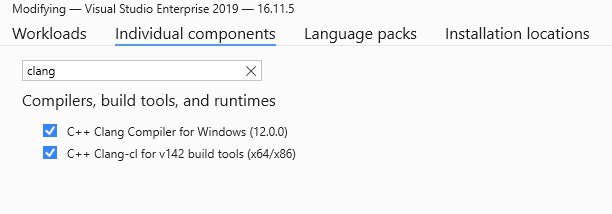
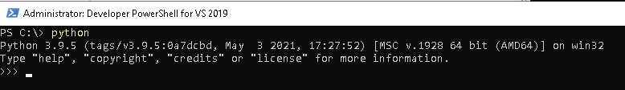
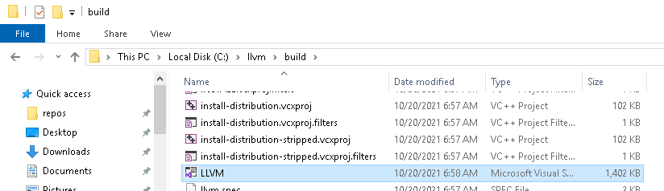
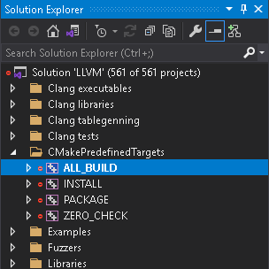
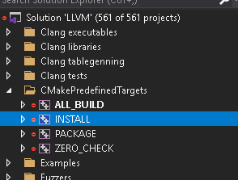
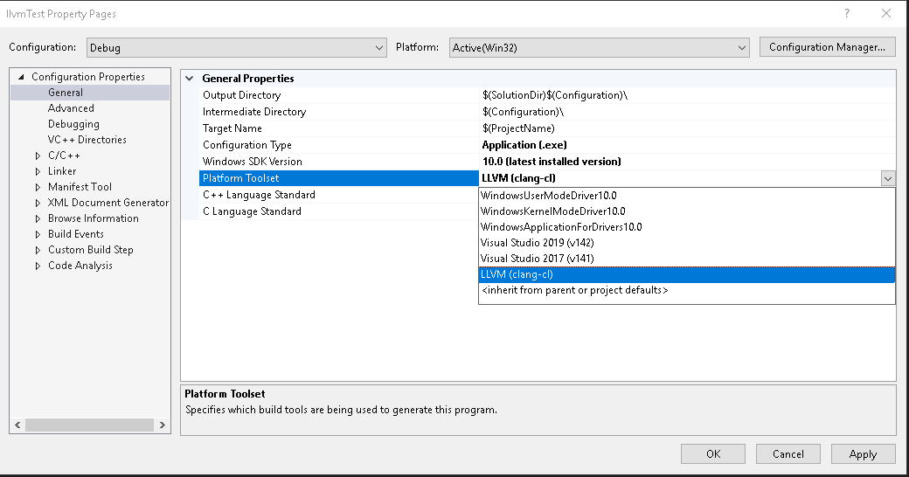

Here at WoldTech we dont work with monolitic compilers. Thats why we exclusively use the llvm compiler infrastructure as our build toolchain.  
In this post I will explain on how to integrate llvm with visual studio

<!--more-->
  
## Build
### Prerequisites
Install cmake.  
Install both clang extensions in Visual Studio.  
  

Make sure python3.6+ is installed.  
  

Install the `psutil` python module
```
pip install psutil
```
### Compile LLVM
Open the Visual Studio developer console and use the commands bellow to generate a visual studio solution to compile llvm.  
Please also checkout all availbe cmake flags at: https://llvm.org/docs/CMake.html#options-and-variables.
```
git clone https://github.com/llvm/llvm-project.git llvm
cd llvm
cmake -S llvm -B build -DLLVM_ENABLE_PROJECTS="clang;lld" -DLLVM_USE_LINKER=lld -DLLVM_TARGETS_TO_BUILD=X86 -DCMAKE_INSTALL_PREFIX="C:\llvm" -Thost=x64
```
This creates the Visual Studio solution in `./llvm/build`.
  

Since compilation will take a really long time i suggest to set the solution's configuration to `Release`.  
Now build the `ALL_BUILD` project to compile llvm.  

<div class="screenshot-row">
  
  
</div>

Run the `INSTALL` project to install llvm to `C:\llvm`

## Using llvm from within Visual Studio
First we create a new Visual Studio project with the name llvmTest.  
Create a `HelloWorld.c` source file with the following contents:
```c
#include <stdio.h>
#include <string.h>

char str1[20] = "I love ";
char str2[12] = "11philip22\n";

int main() {
	int x = 1;
	int y = 2;
	printf("hello world %d\n", (x + y) * (x + y));
	char* newStr = _strdup(str1);
	strcat_s(newStr, 20, str2);
	printf("%s", newStr);

	return 0;
}

```
In the project property page set `Platform Toolset` to `LLVM (clang-cl)`.  

To use our newly build toolchain create a file inside any Visual Studio solution or project called `Directory.build.props` with the contents:
```xml
<Project>
  <PropertyGroup>
    <LLVMInstallDir>C:\llvm</LLVMInstallDir>
	<LLVMToolsVersion>14.0.0</LLVMToolsVersion>
  </PropertyGroup>
</Project>
```
Now Build and Run the project like you would usually do in visual studio.
## Reverences
- https://llvm.org/docs/GettingStartedVS.html
- https://llvm.org/docs/CMake.html
- https://docs.microsoft.com/en-us/cpp/build/clang-support-msbuild?view=msvc-160
